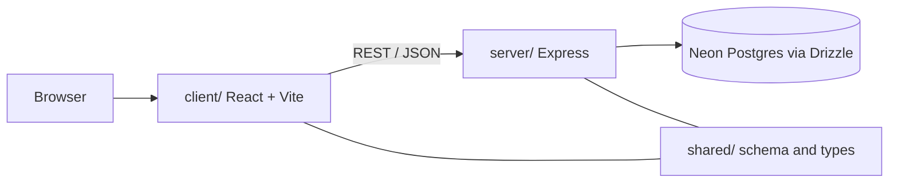

# Portfolio site

Personal portfolio built as a single deployable web app: a Vite-powered React
client, an Express API, and shared TypeScript types in one repository.

## Architecture



| Layer | Role |
| --- | --- |
| `client/` | Routes, UI components, theme, analytics hooks |
| `server/` | HTTP API, auth helpers, static hosting in production |
| `shared/` | Drizzle schema and types consumed by both sides |

## Development

```bash
npm install
npm run dev
```

## License

MIT
