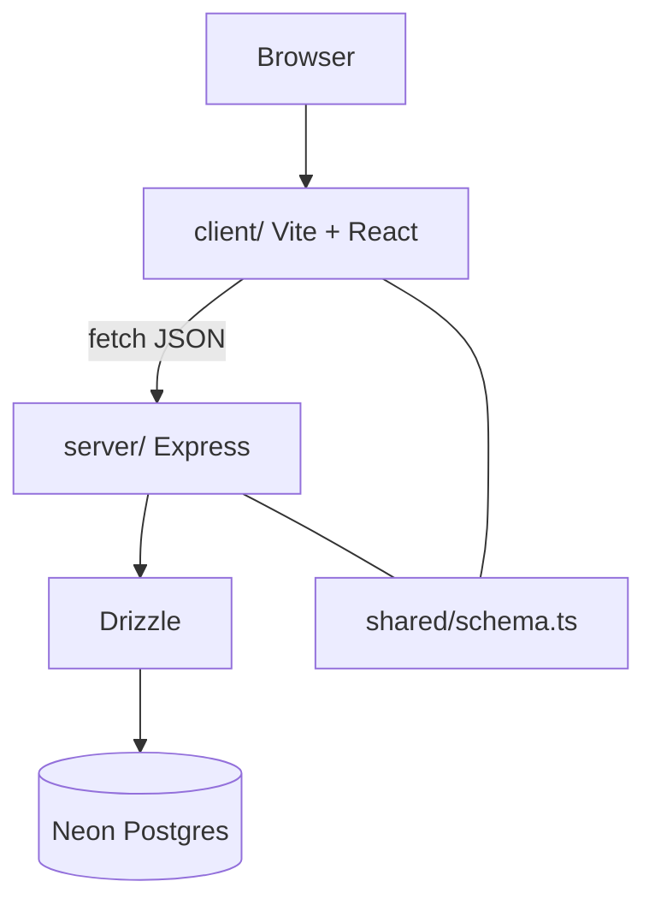

# Portfolio

Single-repo full stack: Vite/React client, Express API, and Drizzle schema shared through `shared/`. One `npm run build` emits both the static client and a bundled Node server for production.

## Architecture



Production path: esbuild bundles `server/index.ts` with externalized node modules; client assets land under `dist/public` and are served by the same process.

## Client

- React 18, Wouter routing, TanStack Query
- Radix-based UI, theme provider, GA hook (`useGoogleAnalytics`)
- Strict TypeScript; `@/` alias to `client/src`

## Server

- Express HTTP API, session-aware helpers under `server/`
- Drizzle + Neon serverless driver (`server/db.ts`)
- Vite dev middleware in development; static `serveStatic` in production

## Commands

```bash
npm install
npm run dev          # API + Vite concurrently via tsx
npm run build        # client + server bundles
npm run start        # node dist/index.js
npm run check        # tsc
npm run db:push      # drizzle-kit push
```

Configure `DATABASE_URL` and session secrets expected by `server/db.ts` and auth modules. See `drizzle.config.ts` for schema location.

## CI

`.github/workflows/ci.yml` runs `npm run check` on push.

## Layout

| Path | Role |
| --- | --- |
| `client/` | Pages, components, hooks |
| `server/` | Routes, DB, production static |
| `shared/` | Drizzle schema + shared types |

## License

MIT
