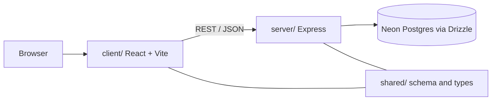

# Portfolio site

Personal portfolio built as a single deployable web app: a Vite-powered React
client, an Express API, and shared TypeScript types in one repository.

## Architecture



| Layer | Role |
| --- | --- |
| `client/` | Routes, UI components, theme, analytics hooks |
| `server/` | HTTP API, auth helpers, static hosting in production |
| `shared/` | Drizzle schema and types consumed by both sides |

## Development

```bash
npm install
npm run dev
```

Other scripts:

- `npm run build` - production client bundle + server bundle
- `npm run start` - run the compiled server
- `npm run check` - TypeScript project check
- `npm run db:push` - apply Drizzle schema to the configured database

## Configuration

Set database and session secrets via environment variables expected by
`server/db.ts` and the auth module. See `drizzle.config.ts` for schema location.

## License

MIT
